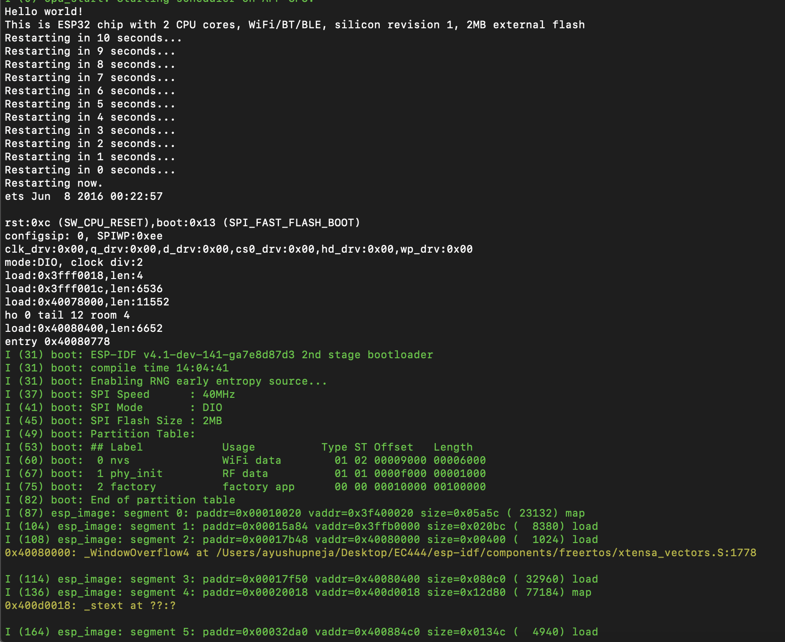

#  05-Toolchain

Author: Ayush Upneja, 2019-09-05

## Summary

I completed all the following tasks:
- Install USB Driver from Adafruit
- Installed prerequisites
- Got ESP-IDF frorm Github and set up tools/environment variables
- Validated that my toolchain works by compiling and flashing 'Hello World' on my ESP32 board in both the examples and my own directory.
    - I added helloworld.png in the images folder to demonstrate my success in the terminal, as seen below
    
- I figured out the serial port and successfully made it work
- I blinked the onboard LED through the esp-idf/examples folder. I had to change the port to #13 in order for the LED to successfully blink.
- A screenshot of the blinking is under blink.png in the images folder and I also uploaded a video to YouTube depicting the process you can see below.

Screenshot:

Video:

## Sketches and Photos

## Modules, Tools, Source Used in Solution

## Supporting Artifacts

-----

## Reminders
- Repo is private
