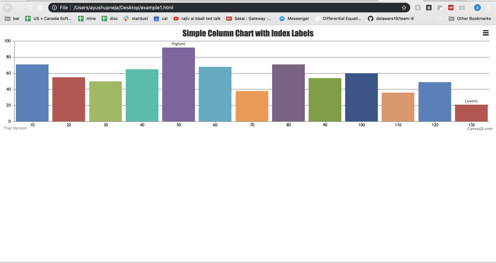
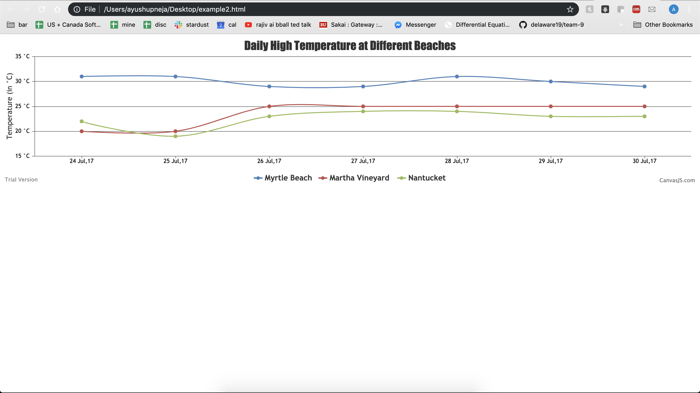
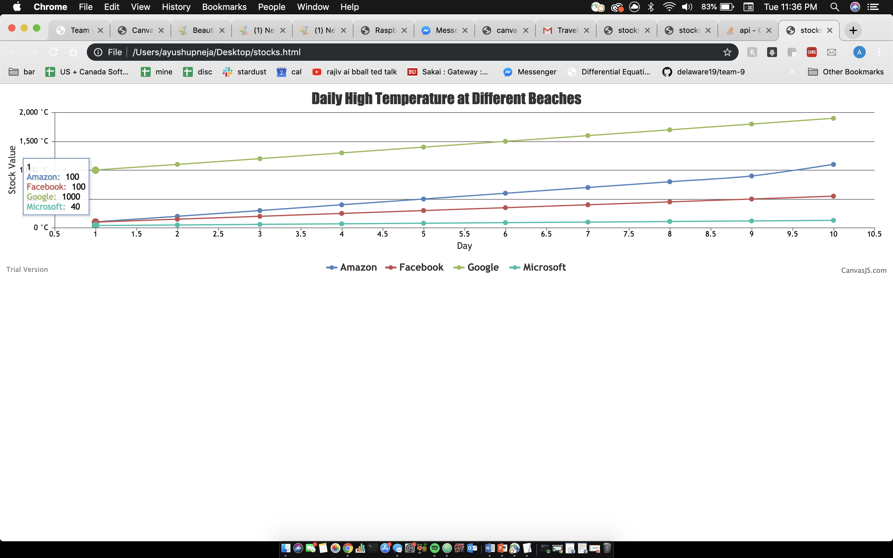

#  Skill 20 Data Visuals

Author: Ayush Upneja, 2019-10-08

## Summary

I picked two examples and ran them successfully from canvasjs. Their pictures and code files are in the relevant folders. I also designed my own chart to depict the stocks data. The code and image are both in their relevant folders. Pictures of them working are below. 

## Sketches and Photos

## Modules, Tools, Source Used in Solution

## Supporting Artifacts

-----

## Reminders
- Repo is private
