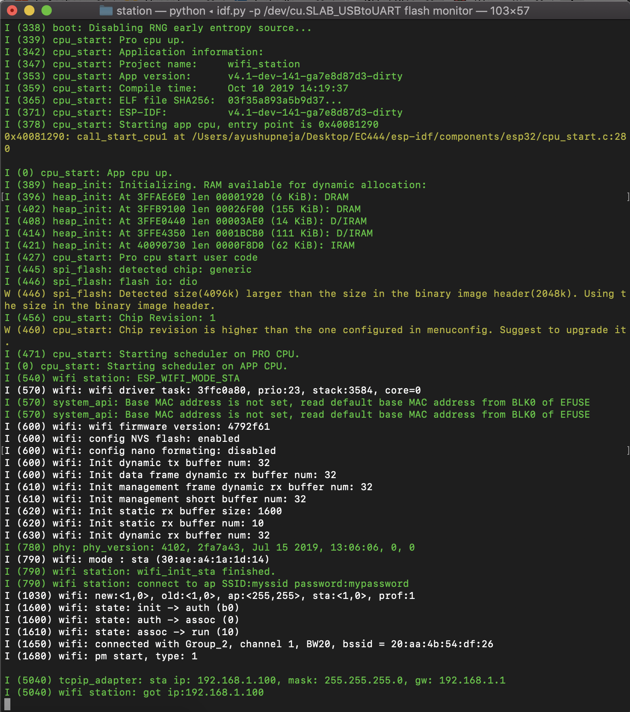
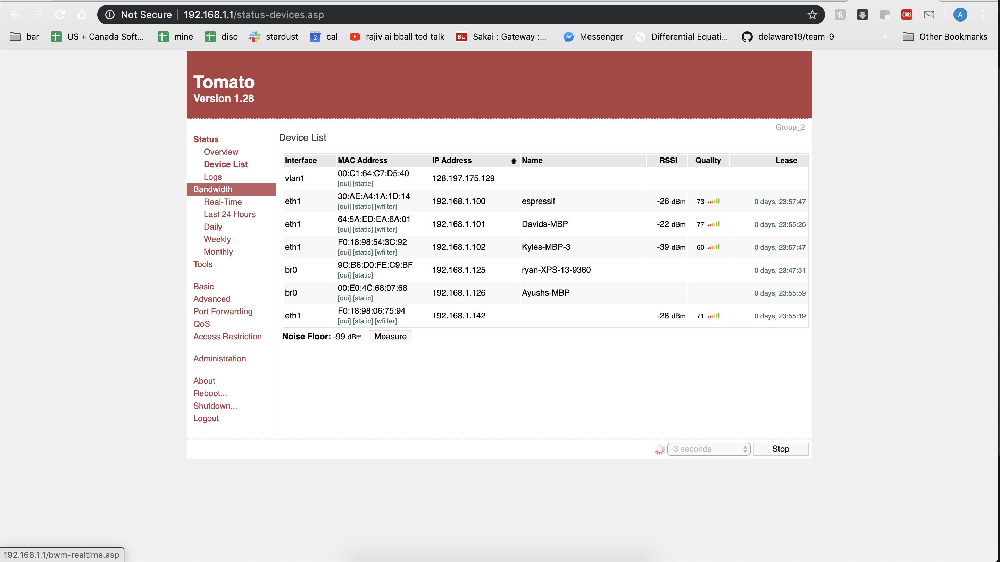

#  Skill 24 Wifi

Author: Ayush Upneja, 2019-10-10

## Summary

I downloaded the WiFi station example and changeed the code to reflect the SSID and passwoord. I successfully built and flashed the file, and the ESP32 was assigned under 192.168.1.100. In the router admin page, I can see that the ESP32 is on the network. Below are the screenshots of the terminal and the admin page.

## Sketches and Photos

## Modules, Tools, Source Used in Solution

## Supporting Artifacts

-----

## Reminders
- Repo is private
