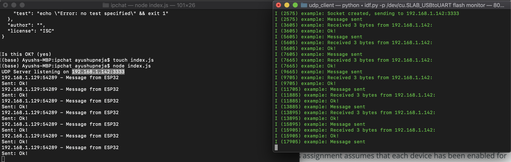

#  Skill 25 ipchat

Author: Ayush Upneja, YYYY-MM-DD

## Summary

I created a program to chat with the console over the network on the IP:port with UDP sockets. A screenshot this working in two terminals is in the images folder labelled ipchat. The relevant code files are also in the code folder! Below is the screencap.

## Sketches and Photos

## Modules, Tools, Source Used in Solution

## Supporting Artifacts

-----

## Reminders
- Repo is private
