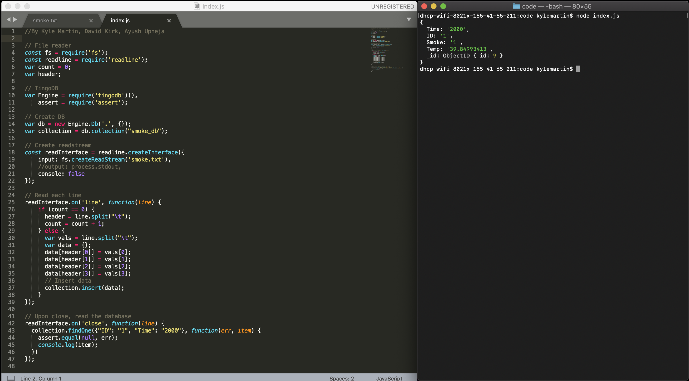

#  Databases

Author: Ayush Upneja, 2019-11-19

## Summary

In this skill, we created a database using TingoDB.  To test it, we read each line of smoke.txt into a JSON object and then inserted each JSON object into a database collection.  Once the file was read, we ran a sample query on the database, determining the sensor readings for sensor 1 at time 2000.

## Sketches and Photos

## Modules, Tools, Source Used in Solution

- http://www.tingodb.com/
- https://docs.mongodb.com/manual/reference/method/db.collection.find/

## Supporting Artifacts

N/A

-----

## Reminders
- Repo is private
